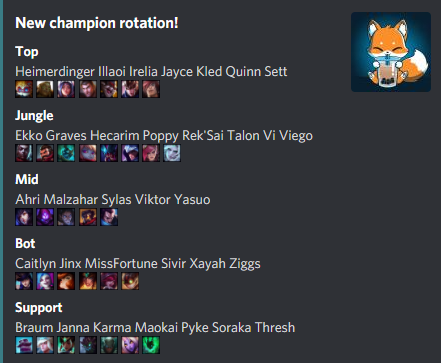

# LeagueOfDravenBot
This queries the Riot Game's API to get the current free champion rotation, then sends it to a discord server (in Kotlin ❤)

## Configuration

Configure [these](src/main/kotlin/me/l3n/bot/discord/lod/model/Config.kt) _(the ones without default are required)_ in (by priority):
  - For AWS Lambda, by priority:
    - Event: the json that is provided when executing the function [example](event-sample.json)
    - Environment variables: the yaml provided when building the function, these are configured in `Variables` of `template.yaml`. [example](template-sample.yaml)
        - _Note: prepend the variable name inside each class like so `bot__mentionEveryone`._
  - Normal Java run:
    - Environment variables in a `application.yaml` [example](application-sample.yaml)

### Message styles

Click here to view

_EmojisOnOwnLine_

_SameLine_

_SeparateLines_

_EmojisOnly_

# Local Java run

`gradle shadowJar`

Running the jar in `build/libs/`:

`java -jar LeagueOfDravenBot.jar`

# Local Lambda run

Copy template-sample.yaml to template.yaml and fill it.

Build: `sam build`

Run: `sam local invoke "LeagueOfDraven-Bot-Kotlin" -e sample-event.json`

Or the `runLambdaLocally` task.

# Deploy

Copy template-sample.yaml to **template-prod.yaml** and fill it.

Build: `sam build`

Deploy: `sam deploy --guided`

After the first deploy, the guided arg can be ommited.
Or the `deployLambda` task can be used.
